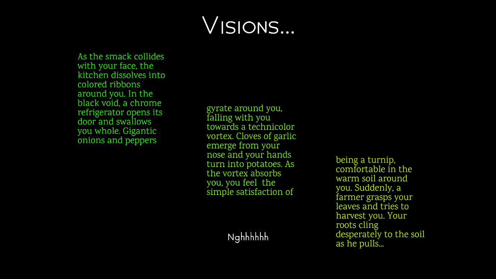

# Another Text Adventure

Author: Thomas Wrabetz

Design: It's a text adventure, now in riveting two-column (or even three-column) format!

Text Drawing: The text is rendered at runtime. I hardcoded the content strings themselves in playmode.cpp.  The rendering code is in TextRenderer.cpp/hpp and TextRenderProgram.cpp/hpp. I leaned heavily on the example another student posted in discord for the OpenGL calls. I made lots of improvements to non-openGL parts of the text rendering, like using harfbuzz glyphs correctly and supporting/caching any character in the font when it is needed. There are attributions in the code. I also added more formatting features, like supporting both automatic and manual line breaks, and overflowing text to arbitrary chains of backup text renderers.

Screen Shot:

How To Play:

Press 1, 2, or 3 to use the leftmost, middle, or rightmost options on the bottom of the screen. (1 = first from the right, 2 = second from the right, 3 = third from the right, so if there is only one option, use key 1).

There are various endings, try to find them all! It shouldn't take too long.

Sources: 

https://github.com/harfbuzz/harfbuzz-tutorial/blob/master/hello-harfbuzz-freetype.c

https://www.freetype.org/freetype2/docs/tutorial/step1.html

https://github.com/ChunanGang/TextBasedGame

This game was built with [NEST](NEST.md).

